# UBCL: Uncertainty-Aware Bayesian Continual Learning for NIDS

Bayesian neural network for network intrusion detection on **UNSW-NB15**, with uncertainty quantification. Current scope: single-phase BNN training and prediction; full UBCL (continual learning under drift, three-way decision) is planned.

## Data

- **UNSW-NB15**: training-set and testing-set CSVs in `data/`.
- Use `data/UNSW_NB15_training-set.csv` and `data/UNSW_NB15_testing-set.csv`. Temporal order is preserved for future streaming/drift experiments.

## Architecture

```mermaid
flowchart LR
    subgraph input [Input]
        Data[UNSW-NB15 CSV]
    end
    subgraph prep [Preprocess]
        Scale[RobustScaler]
        Encode[LabelEncoder]
    end
    subgraph bnn [BNN]
        BL1[BayesianLinear 256]
        BL2[BayesianLinear 128]
        BL3[BayesianLinear 64]
        BL4[BayesianLinear 2]
    end
    subgraph out [Output]
        Pred[Predictions]
        UQ[Uncertainty]
        ThreeWay[Three-way decision]
    end
    Data --> Scale
    Scale --> Encode
    Encode --> BL1
    BL1 --> BL2 --> BL3 --> BL4
    BL4 --> Pred
    Pred --> UQ
    UQ --> ThreeWay
```

- **BNN**: Variational inference (VI), Gaussian priors, 4 layers (256 → 128 → 64 → 2). Log-softmax output.
- **Training**: Class-weighted NLL + KL (warm-up); i.e. class-weighted ELBO.
- **Uncertainty**: Monte Carlo sampling over weight posterior; predictive entropy (combined).
- **Three-way decision** (in prediction): Accept (benign), Reject (attack), or Defer to human, using thresholds τ_benign, τ_attack, η.

## Scripts

| Script | Role |
|--------|------|
| `bnn_train.py` | Reads training-set, trains BNN, saves model to `models/bnn.pth`. |
| `bnn_pred.py` | Loads `models/bnn.pth`, runs on testing-set; reports ML metrics (accuracy, precision, recall, F1, AUC), calibration (ECE, Brier), and three-way decision (accept/reject/defer). |
| `rf_train.py` | Trains Random Forest baseline on training-set; saves `models/rf.pkl`. |
| `rf_pred.py` | Loads `models/rf.pkl`, runs on testing-set; reports same ML and calibration metrics for comparison. Objective: BNN should surpass RF on the same dataset. |

## Requirements

Install: `pip install -r requirements.txt`

- Python 3.x, numpy, pandas, scikit-learn, torch, joblib (see [requirements.txt](requirements.txt)).

## Quick start

1. Place UNSW-NB15 CSVs in `data/`:
   - `data/UNSW_NB15_training-set.csv`
   - `data/UNSW_NB15_testing-set.csv`
2. **BNN:** `python bnn_train.py` then `python bnn_pred.py` — predictions to `models/predictions.csv`.
3. **RF baseline:** `python rf_train.py` then `python rf_pred.py` — predictions to `models/rf_predictions.csv`. Compare metrics to ensure BNN surpasses RF.

## Future work (full UBCL)

- Drift simulation and sequential time-window training (RO1).
- VCL-style continual learning and uncertainty-guided plasticity (RO1/RO2).
- Epistemic vs aleatoric uncertainty decomposition.
- CICIDS2017, baselines (EWC, static BNN), multi-seed evaluation (RO4).

Detailed methodology: [docs/proposal.md](docs/proposal.md).
